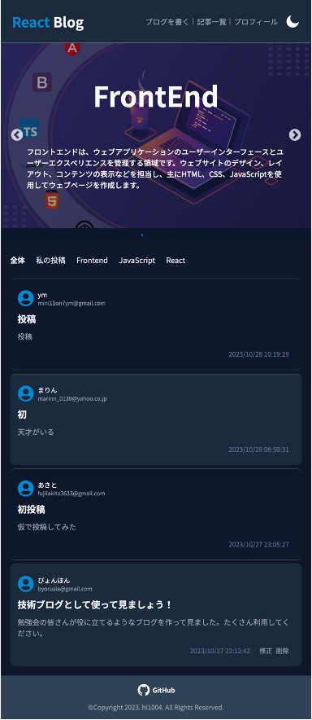

# ICHIGOICHIE - React Blog 
## [🔗 ICHIGOICHIE React Blog Link](https://ichigoichie-83333.web.app/)

## 1. プロジェクト紹介

### 📌 概要
> 勉強会のメンバーに勉強・学習した情報を書き込む技術ブログを活用する目的で作りました。

 

## 2. 開発環境

### 2.1 技術

| フロントエンド | バックエンド | バージョン、イシュー管理 |           
| --- | --- | --- |
|    | |   |

### 2.2 パッケージモジュール

        
- react-toastify
- ract-slick
- toastify-ui/editor